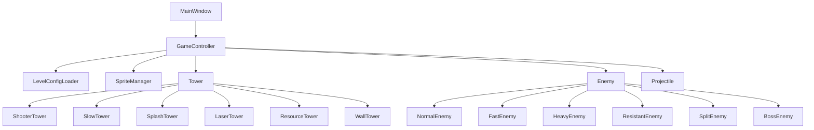

# 网格守卫项目设计说明

## 1. 项目概述

本项目使用 C++20、Qt 6 Widgets 和 CMake 实现 2D 网格塔防游戏。游戏包含开始、选关、
游戏、胜利和失败界面，并通过单一精确计时器驱动敌人、塔、子弹、波次和状态效果更新。

## 2. 模块关系

- `MainWindow`：页面切换、HUD、商店、按钮和鼠标事件。
- `GameController`：游戏状态、单计时器循环、建造、战斗、波次、胜负和存档。
- `Tower` 继承体系：用虚函数动态执行六类不同攻击或生产行为。
- `Enemy` 继承体系：用虚函数实现抗性、分裂和 Boss 特殊能力。
- `LevelConfigLoader`：读取 `config/levels.json` 中的三关地图与五波敌人。
- `SpriteManager`：集中管理 PNG 资源路径与缩放缓存。

## 3. 运行流程

1. 程序读取关卡 JSON 并进入开始界面。
2. 玩家选择关卡，控制器创建 6×10 地图与路线。
3. 玩家选择塔并在合法格子建造；黑土地费用乘以 0.7。
4. 波次管理器按配置生成敌人。
5. 主循环以约 60 FPS 更新塔、敌人、子弹、状态效果和资源。
6. 任意敌人到达终点立即失败；全部波次消灭后胜利。
7. 使用 `QSettings` 保存通关、最佳用时和最高得分。

## 4. 已实现功能

- 五类地形：草地、黑土地、石地、冰面、传送门。
- 六类防御塔和不同费用、射程、冷却、攻击方式。
- 六类敌人；分裂敌人死亡生成小怪，Boss 恢复护盾并召唤增援。
- 三种限时状态：减速、灼烧、眩晕。
- 至少五波、三关、配置读取、通关记录与作弊码。
- 暂停、继续、重新开始、下一关与返回选关。
- 防御塔升级；减速塔“全体冻结”主动技能及冷却时间。
- PNG 素材驱动；没有使用 `paintEvent` 或 `QPainter` 手绘游戏对象。

## 5. 素材与参考

美术素材来自 Kenney 的 Tower Defense (Top-Down) CC0 素材包。完整来源和许可见
项目根目录 `ATTRIBUTION.md` 及 `assets/licenses/Kenney_CC0.txt`。

## 6. AI 工具使用声明（提交前补充个人内容）

### 使用了什么工具

本项目在需求梳理、CMake/Qt 工程骨架、面向对象类设计、基础游戏逻辑和编译调试过程中使用了
OpenAI Codex 作为辅助工具。

### 如何与 AI 交互

向工具提供了课程 PDF、自评表与本机 Qt 环境信息，要求其分析评分点、建立 Qt 6 C++ 工程、
采用素材驱动显示并修复 MinGW 中文路径和编译问题。工具提供了代码初稿、结构建议和调试协助。

### 本人的独立贡献

> 提交前由本人如实填写：例如本人如何阅读并修改代码、设计数值、替换素材、完成游戏测试、
> 修复具体问题，以及如何向助教解释各模块原理。不能原样保留本提示文字。

